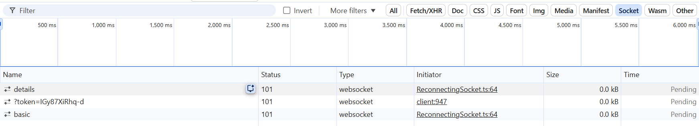

## Quick Start

### 1. root folder:

`npm install`

### 2. BE workspace

Make changes to the file `be/.env`

```
PORT=4000
PLANES_COUNT=20
BASIC_UPDATE_INTERVAL_MS=1000
DETAILED_UPDATE_INTERVAL_MS=1000
```

#### Environment variable description

- `PORT`: WebSocket server port
- `PLANES_COUNT`: Number of simulated planes
- `BASIC_UPDATE_INTERVAL_MS`: Basic data broadcast interval (ms)
- `DETAILED_UPDATE_INTERVAL_MS`: Detailed data interval (ms)

run the development server using an `.env` file

`npm run dev_env` (Node 20+, | --env-file=.env)

### 3. FE workspace

`npm run dev`

[Open in browser]( http://localhost:5173/)

In the developer console, socket connections should appear on the WS tab.


